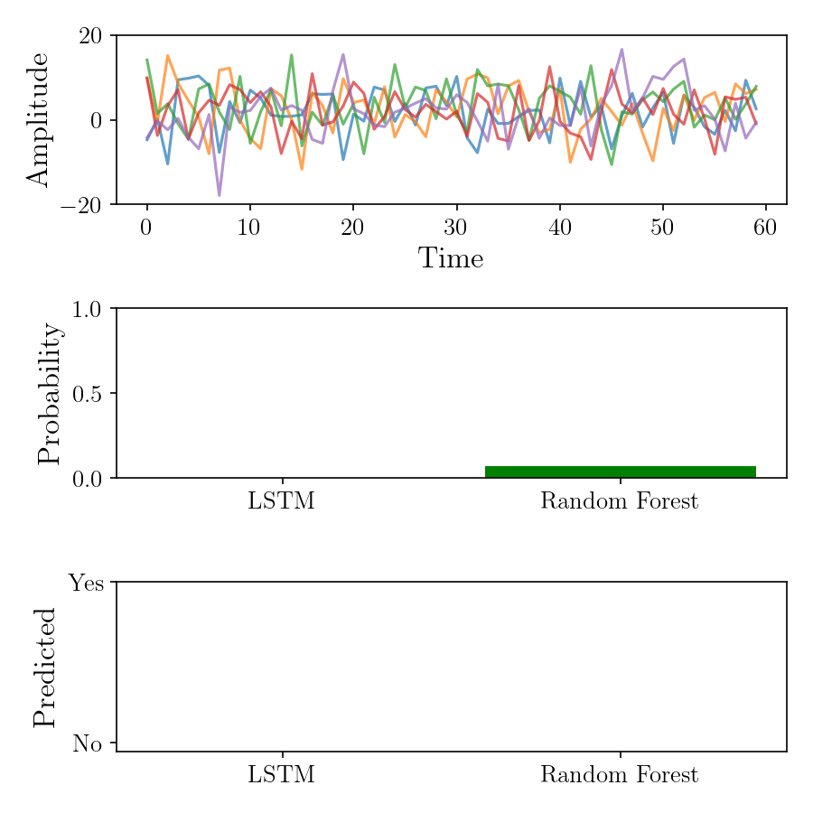

# Predictive Maintenance Using LSTM and Random Forest

This project focuses on developing a predictive maintenance framework using synthetic sensor data to simulate real-world machinery monitoring scenarios. It explores the use of a deep learning approach, specifically an LSTM (Long Short-Term Memory) neural network, to model temporal dependencies in multivariate time-series sensor data. In parallel, a classical machine learning method, the Random Forest classifier, is applied on engineered statistical features extracted from the time series, such as mean, standard deviation, minimum, and maximum values. By comparing these two modeling strategies, the project demonstrates the effectiveness of sequence-based deep learning versus feature-based traditional methods for binary classification tasks related to predicting machine failures or maintenance needs. The pipeline includes data generation, preprocessing, model training, evaluation with multiple metrics, and detailed visualization of both the training process and prediction outcomes. This end-to-end approach highlights the strengths and trade-offs of each method in predictive maintenance applications, aiming to provide insights into selecting suitable models for real-time sensor data analytics.

<p align="center">
  
</p>

---

## 🏦 Repository Structure

```
.
├── data_generation.py         # Synthetic data generator
├── lstm_model.py              # LSTM model architecture
├── evaluate.py                # Model evaluation functions
├── config_plots.py            # Plot configuration utilities
├── main.py                   # Main training and evaluation script (provided code)
├── pred_maintenance_frames/   # Output folder for prediction plots
├── training_loss.png          # Training loss visualization
├── animation.gif              # Animation of predictions (your GIF)
├── README.md                  # This file
└── requirements.txt           # Required Python packages (suggested)
```

---

## 🧩 Installation

1. Clone the repository:

```bash
git clone https://github.com/yourusername/your-repo-name.git
cd your-repo-name
```

2. (Optional) Create and activate a virtual environment:

```bash
python -m venv venv
source venv/bin/activate  # Linux/macOS
venv\Scripts\activate     # Windows
```

3. Install dependencies:

```bash
pip install -r requirements.txt
```

---

## 🔧 Usage

Run the main script to train both models and generate evaluation plots:

```bash
python main.py
```

The script will:

* Generate synthetic sensor data
* Train an LSTM model and a Random Forest classifier
* Evaluate and print metrics (accuracy, precision, recall, F1-score, etc.)
* Save training loss curves and prediction visualizations to disk

---

## 📦 Dependencies

* Python 3.8+
* numpy
* matplotlib
* scikit-learn
* torch (PyTorch)
* tqdm

You can install all with:

```bash
pip install numpy matplotlib scikit-learn torch tqdm
```

---

## 📚 Related Projects 

This project builds on concepts from multimodal representation learning, attention-based fusion, and anomaly detection in industrial systems. Below are selected related works and projects that inspired or complement this research:

<a id="1">[1]</a> Altinses, D., & Schwung, A. (2023, October). Multimodal Synthetic Dataset Balancing: A Framework for Realistic and Balanced Training Data Generation in Industrial Settings. In IECON 2023-49th Annual Conference of the IEEE Industrial Electronics Society (pp. 1-7). IEEE.

<a id="2">[2]</a> Altinses, D., & Schwung, A. (2025). Performance benchmarking of multimodal data-driven approaches in industrial settings. Machine Learning with Applications, 100691.

<a id="3">[3]</a> Altinses, D., & Schwung, A. (2023, October). Deep Multimodal Fusion with Corrupted Spatio-Temporal Data Using Fuzzy Regularization. In IECON 2023-49th Annual Conference of the IEEE Industrial Electronics Society (pp. 1-7). IEEE.

<a id="3">[4]</a> Altinses, D., Torres, D. O. S., Lier, S., & Schwung, A. (2025, February). Neural Data Fusion Enhanced PD Control for Precision Drone Landing in Synthetic Environments. In 2025 IEEE International Conference on Mechatronics (ICM) (pp. 1-7). IEEE.

<a id="3">[5]</a> Torres, D. O. S., Altinses, D., & Schwung, A. (2025, March). Data Imputation Techniques Using the Bag of Functions: Addressing Variable Input Lengths and Missing Data in Time Series Decomposition. In 2025 IEEE International Conference on Industrial Technology (ICIT) (pp. 1-7). IEEE.

